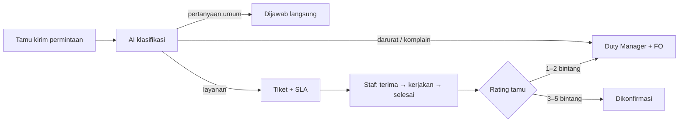

<div align="center">


# HOSPI AI

**Asisten layanan hotel berbasis AI yang mengubah setiap permintaan tamu menjadi tugas terlacak untuk tim yang tepat.**

*An AI hotel service assistant that turns every guest request into a routed, tracked task for the right team.*

[**Buka demo →**](https://hospi-ai.vercel.app) &nbsp;·&nbsp; [Mode Presentasi](https://hospi-ai.vercel.app/present) &nbsp;·&nbsp; [Pilih tampilan](https://hospi-ai.vercel.app/demo)

</div>

---

## Apa itu HOSPI AI?

Di banyak hotel, permintaan tamu masih lewat telepon, catatan kertas, atau chat yang tercecer, sehingga mudah terlupa, lambat ditangani, dan sulit diukur. HOSPI AI menyatukan semuanya:

1. **Tamu** memindai QR di kamar dan langsung bisa meminta apa saja lewat chat atau suara, dalam 8 bahasa, tanpa instal aplikasi dan tanpa akun.
2. **AI** memahami pesan itu, menentukan departemen dan prioritasnya, lalu membuat tiket berisi instruksi kerja berbahasa Indonesia.
3. **Staf** menerima tiket secara langsung di dashboard departemennya, lengkap dengan target waktu (SLA), lalu mengerjakannya sampai selesai.
4. **Tamu** memantau progresnya dan memberi rating. Rating buruk otomatis dieskalasi ke Duty Manager.



## Fitur

### Untuk tamu
- **Chat AI dan pesan suara** dalam 8 bahasa: Indonesia, Inggris, Jepang, Korea, Mandarin, Rusia, Prancis, Jerman.
- **Tombol cepat**: handuk & perlengkapan mandi, bantal, bersih kamar, AC, air mineral, bantuan bawa tas, late check-out.
- **Pesan makanan** dari menu; pesanan baru dikirim ke dapur setelah tamu mengonfirmasi, tagihan masuk ke kamar.
- **Wisata sekitar**: rekomendasi tempat sesuai waktu (pagi/siang/sore), plus pesan mobil dengan sopir yang langsung masuk ke Front Office.
- **Tombol darurat** yang memberi tahu Front Office dan Duty Manager dengan alarm.
- **Lacak permintaan** dan beri rating 1–5 bintang.
- **Ramah untuk semua usia**: ukuran teks bisa diperbesar, panduan singkat saat pertama kali membuka, bahasa yang sederhana.

### Untuk staf
- **Dashboard per peran**: Front Office, Housekeeping, Maintenance, Food & Beverage, Duty Manager.
- **Antrean tiket langsung** dengan timer SLA (sesuai target / hampir telat / terlambat) dan notifikasi saat lewat batas.
- **Siklus tiket lengkap**: Baru → Diterima → Dikerjakan → Selesai → Dikonfirmasi, serta bisa ditunda, dialihkan, atau dibatalkan.
- **Papan dapur** untuk pesanan makanan dan **papan tugas** untuk Housekeeping & Maintenance.
- **Ambil alih percakapan**: saat tamu minta bicara dengan staf, AI berhenti membalas dan staf membalas langsung.
- **Persetujuan late check-out**, status kamar, data tamu, dan **analitik** (waktu respons, kepatuhan SLA, rating per departemen).
- **Privasi**: nama tamu disamarkan untuk Housekeeping, Maintenance, dan F&B; riwayat tamu bisa dianonimkan setelah check-out.

### Di balik layar
- **Klasifikasi AI** memakai Gemini bila `GEMINI_API_KEY` dipasang; tanpa key, dipakai pengklasifikasi berbasis aturan yang memahami 8 bahasa. Aturan keselamatan (darurat, komplain, minta staf) selalu dijalankan, apa pun penyedianya.
- **Penggabungan duplikat**: permintaan yang sama dari kamar yang sama dalam 10 menit digabung ke satu tiket.
- **Sinkron antar perangkat**: yang dikirim tamu dari HP muncul di laptop staf dalam sekitar 1–2 detik.
- **Penawaran kontekstual** (tur, spa, antar bandara) yang tidak pernah muncul saat darurat, komplain, atau laporan kerusakan.

## Cara mencoba demo

| Ingin melihat | Buka |
|---|---|
| Tamu dan staf berdampingan, dengan skenario siap pakai | [`/present`](https://hospi-ai.vercel.app/present) |
| Pilihan semua tampilan | [`/demo`](https://hospi-ai.vercel.app/demo) |
| Aplikasi tamu kamar 508 | [`/enter?as=guest&room=508`](https://hospi-ai.vercel.app/enter?as=guest&room=508) |
| Dashboard Front Office | [`/enter?as=front_office`](https://hospi-ai.vercel.app/enter?as=front_office) |

Peran staf lain: `housekeeping`, `maintenance`, `food_beverage`, `duty_manager`. Di setiap layar ada tombol **Ganti tampilan** untuk berpindah peran dengan satu klik.

Contoh pesan untuk dicoba di chat tamu: *"AC kamar saya tidak dingin"*, *"Boleh minta dua handuk dan air mineral?"*, *"Saya mau nasi goreng dan jus jeruk"*, *"Ada rekomendasi tempat wisata?"*.

> Semua data di demo adalah data contoh. Integrasi PMS dan POS disimulasikan.

## Teknologi

- **Frontend:** React 19, TypeScript, Vite 6, Tailwind CSS v4, React Router 7, lucide-react
- **Backend:** Express (dijalankan sebagai fungsi serverless di Vercel)
- **AI:** Google Gemini (`@google/genai`), dengan cadangan pengklasifikasi berbasis aturan
- **Sinkronisasi:** memori server, atau Redis (Upstash) bila dipasang

## Menjalankan di komputer sendiri

Butuh **Node.js 20** atau lebih baru.

```bash
npm install
npm run dev
```

Lalu buka **http://localhost:3000**.

Perintah lain:

| Perintah | Fungsi |
|---|---|
| `npm run lint` | Cek tipe TypeScript |
| `npm run build` | Build frontend + server untuk dijalankan dengan Node |
| `npm start` | Menjalankan hasil `npm run build` |
| `npm run build:vercel` | Build untuk deploy ke Vercel |

### Variabel lingkungan (opsional)

Salin `.env.example` menjadi `.env`. Semua variabel bersifat opsional; tanpa satu pun, aplikasi tetap berjalan penuh.

| Variabel | Fungsi |
|---|---|
| `GEMINI_API_KEY` | Memakai Gemini untuk memahami pesan tamu dan transkripsi suara di server. Tanpa ini dipakai pengklasifikasi aturan dan pengenalan suara browser. |
| `KV_REST_API_URL`, `KV_REST_API_TOKEN` | Redis (Upstash) untuk sinkron antar perangkat yang andal di Vercel. Bisa juga `UPSTASH_REDIS_REST_URL` dan `UPSTASH_REDIS_REST_TOKEN`. |
| `PORT` | Port server lokal (bawaan 3000). |

Jangan pernah menulis API key langsung di kode. Di Vercel, isi lewat **Settings → Environment Variables**.

## Deploy ke Vercel

1. Import repo ini di [vercel.com/new](https://vercel.com/new).
2. Pengaturan build sudah ada di `vercel.json` (`npm run build:vercel`, output `dist`), jadi cukup klik **Deploy**.
3. (Disarankan) Tambahkan **Storage → Upstash for Redis** (paket gratis) dan sambungkan ke project, lalu deploy ulang. Cek di `/api/health`: `"syncStore"` harus bernilai `"redis"`.

## Struktur proyek

```
├── server.ts              # Server Express: API tiket, AI, sinkronisasi, PMS/POS, privasi
├── server/
│   ├── ai/                # Klasifikasi pesan: Gemini + pengklasifikasi aturan
│   ├── sync.ts            # Sinkron antar perangkat (memori / Redis)
│   └── redis.ts           # Klien Upstash Redis via REST
├── api/                   # Entry fungsi serverless Vercel
└── src/
    ├── features/
    │   ├── landing/       # Halaman depan
    │   ├── entry/         # Masuk tamu, pilih demo, ganti peran
    │   ├── guest/         # Aplikasi tamu (beranda, chat, makanan, wisata, permintaan)
    │   ├── staff/         # Dashboard staf per departemen
    │   └── present/       # Mode Presentasi
    ├── context/           # State aplikasi dan mesin sinkronisasi
    ├── data/              # Menu, SLA, tempat wisata, penawaran, data contoh
    ├── i18n/              # Terjemahan 8 bahasa
    ├── components/        # Komponen UI bersama
    └── theme/             # Tema terang/gelap dan ukuran teks
```

## API

| Metode | Endpoint | Fungsi |
|---|---|---|
| `GET` | `/api/health` | Status server, penyedia AI, dan penyimpanan sinkronisasi |
| `POST` | `/api/ai/process` | Klasifikasi pesan tamu |
| `POST` | `/api/ai/transcribe-audio` | Transkripsi pesan suara (butuh `GEMINI_API_KEY`; tanpa key, aplikasi memakai pengenalan suara browser) |
| `POST` | `/api/sync` | Sinkronisasi data antar perangkat |
| `GET` `POST` | `/api/tickets` | Daftar & buat tiket (permintaan ganda digabung) |
| `PATCH` `DELETE` | `/api/tickets/:id` | Ubah & hapus tiket |
| `GET` | `/api/pms/reservation/:room`, `/api/pms/folio/:room` | Data reservasi & tagihan (simulasi) |
| `POST` | `/api/pos/order` | Kirim pesanan ke POS (simulasi) |
| `POST` | `/api/privacy/redact`, `/api/privacy/anonymize` | Penyamaran & anonimisasi data tamu |
